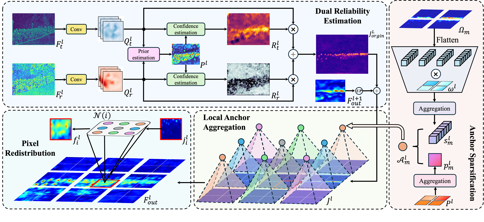

<p align="center">
  
</p>


<h2 align="center">RACANet: Aware Crowd Anchor Network for RGB-T Crowd Counting</h2>

<p align="center">
  Implementation of RACANet for RGB-T crowd counting.
</p>


## 🧭 Overview

<div>
  
</div>


**Figure 1: The RACANet framework.**

### Local Anchor Fusion Module (LAFM)

<div>
  
</div>


**Figure 2: Detailed architecture of the Local Anchor Fusion Module (LAFM).**

**Abstract** - RGB-T crowd counting aims to integrate visible-spectrum and thermal infrared information to improve the robustness of crowd density estimation in complex scenes. Although existing studies generally improve counting accuracy through cross-modal feature fusion, most current methods rely on implicit cross-modal fusion strategies and lack explicit modeling of local spatial discrepancies as well as fine-grained characterization of modality reliability at the positional level, thereby limiting the accuracy and interpretability of the fusion process. To address these issues, this paper proposes a two-stage fusion framework, RACANet, a Reliability-Aware Crowd Anchor Network for RGB-T Crowd Counting. First, we design a lightweight cross-modal alignment pretraining stage, which explicitly learns cross-modal semantic correspondences through crowd-prior supervision and local bidirectional soft matching. Then, based on the priors generated during pretraining, a Local Anchor Fusion Module (LAFM) is introduced in the formal training stage. This module generates local semantic anchors by aggregating features from highly reliable regions and further enables adaptive pixel-level feature redistribution with the aid of a local attention mechanism. In addition, we propose a discrepancy-aware consistency constraint to dynamically coordinate the reliability of regions where modal representations are consistent. Experiments conducted on two widely used benchmark datasets, RGBT-CC and Drone-RGBT, demonstrate that RACANet outperforms existing methods. 

## 🗂️ Datasets

We evaluate RACANet on two widely used RGB-T crowd counting datasets:

- [RGBT-CC](https://github.com/chen-judge/RGBTCrowdCounting)
- [Drone-RGBT](https://github.com/VisDrone/DroneRGBT)

### RGBT-CC Directory Format

```text
RGBT_CC/
+-- train/
|   +-- 1162_RGB.jpg
|   +-- 1162_T.jpg
|   +-- 1162_GT.npy
|   +-- ...
+-- val/
|   +-- 1157_RGB.jpg
|   +-- 1157_T.jpg
|   +-- 1157_GT.npy
|   +-- ...
+-- test/
    +-- 1197_RGB.jpg
    +-- 1197_T.jpg
    +-- 1197_GT.npy
    +-- ...
```

### Drone-RGBT Directory Format

```text
Drone-RGBT/
+-- train/
|   +-- GT_/
|   |   +-- 1R.xml
|   |   +-- 2R.xml
|   |   +-- ...
|   +-- RGB/
|   |   +-- 1.jpg
|   |   +-- 2.jpg
|   |   +-- ...
|   +-- Infrared/
|       +-- 1R.jpg
|       +-- 2R.jpg
|       +-- ...
+-- test/
    +-- GT_/
    |   +-- 1R.xml
    |   +-- 2R.xml
    |   +-- ...
    +-- RGB/
    |   +-- 1.jpg
    |   +-- 2.jpg
    |   +-- ...
    +-- Infrared/
        +-- 1R.jpg
        +-- 2R.jpg
        +-- ...
+-- samples/
    +-- 1R.jpg
    +-- 1R.xml
    +-- ...
```

## 📊 Experimental Results

**Table 1. Comparison of different methods on the RGBT-CC dataset.**

|       Method       |  Venue  |  Backbone  |   GAME0   |   GAME1   |   GAME2   |   GAME3   |   RMSE    |
| :----------------: | :-----: | :--------: | :-------: | :-------: | :-------: | :-------: | :-------: |
|       MMCCN        | ACCV'20 | ResNet-50  |   13.82   |   17.83   |   22.20   |   29.64   |   24.36   |
|      BL+IADM       | CVPR'21 |   VGG-19   |   15.61   |   19.95   |   24.69   |   32.89   |   28.18   |
|       DEFNet       | TITS'22 |   VGG-16   |   11.90   |   16.08   |   20.19   |   27.27   |   21.09   |
|       CCANet       | TMM'23  |   VGG-16   |   13.93   |   18.13   |   22.08   |   28.26   |   24.71   |
|      CSA-Net       | ESWA'23 |   VGG-19   |   12.45   |   16.46   |   21.48   |   30.62   |   21.64   |
|       CGINet       | EAAI'23 |  ConvNext  |   12.07   |   15.98   |   20.06   |   27.73   |   20.54   |
|       MC3Net       | TITS'23 |  ConvNext  |   11.47   |   15.06   |   19.40   |   27.95   |   20.59   |
|        MCN         | ESWA'24 | PoolFormer |   11.56   |   15.92   |   20.16   |   28.06   |   19.02   |
|       C4-MIM       | CAIS'24 |   VGG-19   |   11.27   |   15.02   |   19.31   |   25.33   |   20.31   |
|      CFAF-Net      | EAAI'24 |   VGG-19   |   11.07   |   14.96   |   19.65   |   29.05   |   18.83   |
|     CrowdAlign     | IVC'24  |   VGG-19   |   11.07   |   14.83   |   19.44   |   28.65   |   19.78   |
|      GETANet       | GRSL'24 |    PVT     |   12.14   |   15.98   |   19.40   |   28.61   |   22.17   |
|      BGDFNet       | TIM'24  |   VGG-16   |   11.00   |   15.04   |   19.86   |   29.72   |   19.05   |
|        CSCA        |  PR'25  |   VGG-19   |   13.50   |   18.63   |   23.59   |   31.59   |   24.83   |
|       MSPNet       | TCE'25  |   IR-50    |   12.20   |   16.50   |   20.51   |   27.84   |   21.49   |
|       MIANet       | TITS'25 |   VGG-19   |   11.97   |   15.65   |   19.93   |   27.54   |   22.17   |
|      MISF-Net      | TMM'25  |   VGG-16   |   10.90   |   14.87   |   19.65   |   29.18   |   19.42   |
| **RACANet (Ours)** |    -    | **PVTv2**  | **10.18** | **14.19** | **18.12** | **25.33** | **18.13** |

**Table 2. Comparison of different methods on the DroneRGBT dataset.**

|       Method       |  Venue  |   Backbone   |  GAME0   |  GAME1   |  GAME2   |   GAME3   |   RMSE   |
| :----------------: | :-----: | :----------: | :------: | :------: | :------: | :-------: | :------: |
|       MMCCN        | ACCV'20 |  ResNet-50   |   7.27   |    -     |    -     |     -     |  11.45   |
|      BL+IADM       | CVPR'21 |    VGG-19    |   9.70   |  12.04   |  15.31   |   20.31   |  15.01   |
|       DEFNet       | TITS'22 |    VGG-16    |   7.89   |   9.60   |  11.96   |   15.34   |  12.88   |
|       CGINet       | EAAI'23 |   ConvNext   |   8.37   |   9.97   |  12.34   |   15.51   |  13.45   |
|       MC3Net       | TITS'23 |   ConvNext   |   7.33   |    -     |    -     |     -     |  11.17   |
|     CrowdAlign     | IVC'24  |    VGG-19    |   7.03   |    -     |    -     |     -     |  10.96   |
|      GETANet       | GRSL'24 |     PVT      |   8.44   |  10.01   |  12.75   |   15.83   |  13.99   |
|        BMCC        | ECCV'24 | VGG-19 & ViT |   6.20   |    -     |    -     |     -     |  10.40   |
|        CSCA        |  PR'25  |    VGG-19    |   9.51   |  12.12   |  15.84   |   21.57   |  15.19   |
|       MIANet       | TITS'25 |    VGG-19    |   6.74   |   8.64   |  11.49   |   16.31   |  10.58   |
|        CMFX        |  NN'25  |    VGG-19    |   6.75   |   8.88   |  11.87   |   14.69   |  11.05   |
| **RACANet (Ours)** |    -    |  **PVTv2**   | **5.23** | **6.69** | **8.78** | **12.08** | **8.18** |

<div>
  
</div>


**Figure 3: Visualization results of the proposed RACANet under various complex scenarios. From left to right: (a) RGB image and the ground-truth count; (b) thermal infrared image; (c) joint crowd-aware prior $P^l$; (d) reliability map of the RGB modality, $R_r$, where highlighted regions indicate higher confidence of this modality at the corresponding local positions; (e) reliability map of the thermal modality, $R_t$; (f) output features of the LAFM; (g) predicted density map and the estimated crowd count. The visualization results show that RACANet can adaptively assess modality reliability and accurately estimate crowd density under conditions of insufficient illumination or thermal noise interference.**

## 🚀 Getting Started

#### 1. Data Preparation

Prepare datasets according to the directory formats above.

#### 2. Environment Setup

The core libraries are as follows:

```text
torch: 1.11.0+cu113
torchvision: 0.12.0+cu113
timm: 1.0.12
mmcv-full: 1.7.2
mmdet: 3.3.0 (dev)
mmengine: 0.10.5
numpy: 1.22.4
scipy: 1.10.1
scikit-learn: 1.3.2
```

Additional runtime dependencies:

```text
opencv-python
Pillow
```

#### 3. Warm-up Pretraining

Warm-up pretraining explicitly learns cross-modal local alignment through candidate-region supervision and bidirectional local soft matching, and provides transferable initialization for formal RACANet training.

```bash
python pretrain.py \
  --dataset <DroneRGBT or RGBCTT> \
  --data-dir <YOUR_DATA_DIR> \
  --save-dir <YOUR_PRETRAIN_SAVE_DIR>
```

#### 4. Main Training

Key arguments in main training:

- `--anchor-kernel`: local window size for anchor aggregation.
- `--local-window`: neighborhood size for pixel-anchor interaction.
- `--lambda-cons`: weight of multi-stage reliability consistency loss.
- `--warmup-weights`: optional path to warm-up pretrained weights.

If `--warmup-weights` is provided, RACANet will load transferable warm-up parameters for initialization. If it is not provided, the model uses ImageNet-1K pretrained PVTv2-B3 backbones from `pretrained_weights/pvt_v2_b3.pth` by default.

Download link (placeholder): [PVTv2-B3 ImageNet-1K weights](https://drive.google.com/file/d/xxxx_pvtv2_b3/view?usp=sharing)

After downloading it, put the pvt_v2_b3.pth file in the pretrained_weights folder.

```bash
python train.py \
  --dataset <DroneRGBT or RGBCTT> \
  --data-dir <YOUR_DATA_DIR> \
  --save-dir <YOUR_TRAIN_SAVE_DIR> \
  --lr 1e-4 \
  --anchor-kernel 3 \
  --local-window 3 \
  --lambda-cons 0.1
```

#### 5. Testing

We provide trained RACANet checkpoints on both datasets in Google Drive (placeholder link): [RACANet pretrained checkpoints](https://drive.google.com/drive/folders/xxxx_racanet_checkpoints?usp=sharing).

You can evaluate using your own trained checkpoints, or directly run inference with our provided checkpoints.

```bash
python test.py \
  --dataset <DroneRGBT or RGBCTT> \
  --data-dir <YOUR_DATA_DIR> \
  --model-path <YOUR_CHECKPOINT_PATH>  # (RGBTCC_best.pth or Drone_best.pth)
```

## 📝 Citation

```bibtex
Coming soon...
```

## 📄 License

The source code is free for research and education use only. Any commercial use should get formal permission first.
